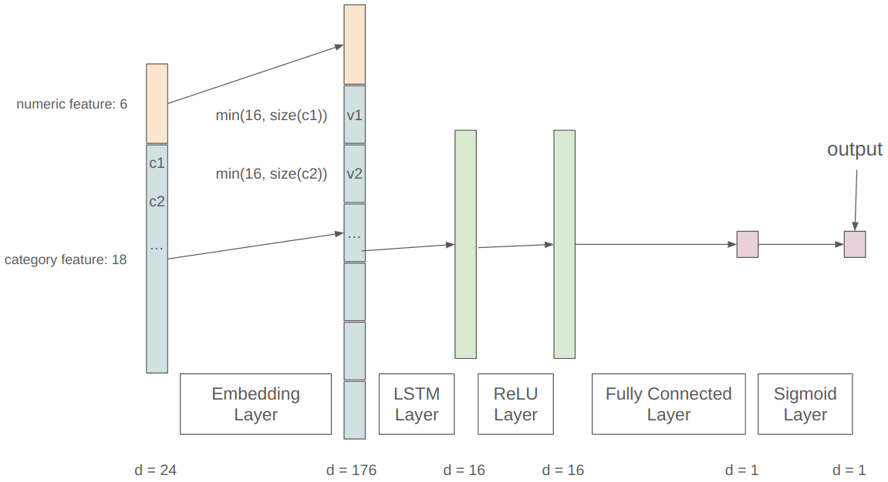

# Credit Card Fraud Detection

### METHOD 1 RNN

#### Illustration of the Architecture 



#### Data Preprocessing

##### Numeric Feature

`['locdt', 'loctm', 'conam', 'iterm', 'flam1', 'csmam']`

Step 1. Convert string to integer

Step 2. Normalization

##### Category feature

`['chid', 'cano', 'contp', 'etymd', 'mchno', 'acqic', 'mcc', 'ecfg', 'ins
fg', 'bnsfg', 'stocn', 'scity', 'stscd', 'ovrlt', 'flbmk', 'hcefg', 'csmcu', 'flg_3dsmk']`

Step 1. Convert string to token 

Step 2. Embedding (`vector size = min(16, vocabulary size)`)

#### Training

Step 1. Embedding

Step 2. Concatenate numeric and embedded category features

Step 3. RNN forward pass (LSTM)

Step 4. Fully connected layer for prediction

#### TODO

1. Prediction

   (1) Threshold

   (2) Voting

2. Accelerate

   (1) Adjust parameter, e.g. hidden size, train batch, vector size, etc. 

### METHOD 2 XGBoost

#### Data Preprocessing

##### Numeric Feature

`['locdt', 'loctm', 'conam', 'iterm', 'flam1', 'csmam']`

Step 1. Convert string to integer **without** normalization

##### Category feature

`['chid', 'cano', 'contp', 'etymd', 'mchno', 'acqic', 'mcc', 'ecfg', 'ins
fg', 'bnsfg', 'stocn', 'scity', 'stscd', 'ovrlt', 'flbmk', 'hcefg', 'csmcu', 'flg_3dsmk']`

Step 1. Replace it with the probability of fraud. 

#### Training

```bash
$ cd XGB
$ python train.py
```

#### Inference

```bash
$ python predict.py
```

